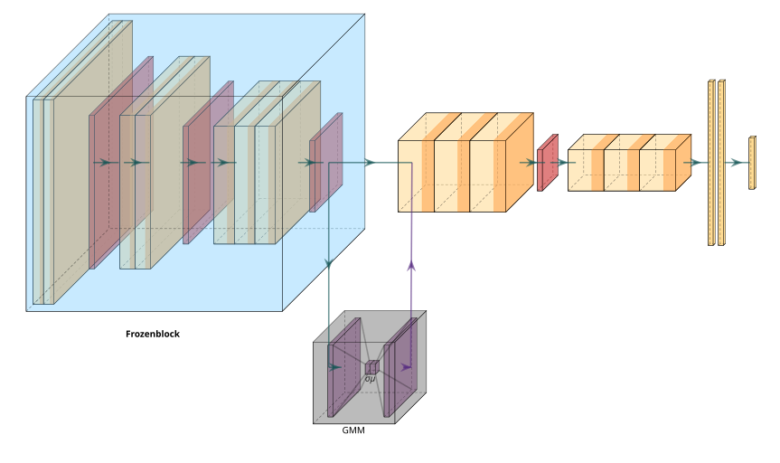

<div align="center">

# Generative Latent Replay

[](https://github.com/iacobo/generative-latent-replay/blob/main/Generative_Latent_Replay.pdf) [](https://pytorch.org/) [](https://opensource.org/licenses/gpl-3-0) [![Avalanche](https://img.shields.io/badge/%E2%80%8B-Avalanche-29B6F6.svg?style=flat&logo=data:image/png;base64,iVBORw0KGgoAAAANSUhEUgAAADAAAAA8CAYAAAAgwDn8AAAAAXNSR0IArs4c6QAAAARnQU1BAACxjwv8YQUAAAAJcEhZcwAAJOgAACToAYJjBRwAAAZvSURBVGhDzZpbbBRVGMe/ndlL99bttu42BRVWYkpM5KJGAwkxMSHaGF4wAUohPJioIYSEWB80GlFRXyAYooiJDxogiCb4gAYbHgghoOUFqolBFCtykzbS1rLde9fznflmZ7pz2TPd3Sm/ZHK+M3Rm//85Z875zhk8GzduLMMcEnnlMC/LR3dAemyEx06QqHSdWHuiIh7xrN8LoUgr1cSZEwMovrTuI6ppFIIdFInjugEr8YgXpikSx1UDduKRzOhVisRxzUAt8b6j2yhyhisGRMSPjY1RzRlNN9BM8UjTDdiJjw+8XZd4pKkG9ON8NfGBnXBt+A+qzZ6mGbAT38bF/041I74Fy/n1eLSs3k5nzWmKgVrir9uIRwI9/RSxuWHRUxBY2kM1Iw03UK/4cDhKkYYn+TBFRhpqoF7xSDo9SZGGfP4QRUYaZsBOfExQvIp8ZCv4ocRS1DKET+yE9MQd+hcjDUmn7cS3/vAO3PzrMtWMhONJ1AlT485TaaRuA3biO3/cD1eGzlLNSPW1dw/0USROXV3ITjziRDzijyUoEmfWBmqJt8PqWo8/RJE4szIgKj4YNq6w7K7NNTudxsTMyZOXN38KwWSKx0G2XLS7NjHwFkXmSIkUn5X5oXswwi9xrayyHlD88PCfVDMis9QiqJudEfWFF2qBWuKLVwYNhyiYkToVj4RoxhZqAbOmR5Gli8fBm7kDmbsTdFYj0pmCXOdiCKzcRGfMsRs6Q20JkDaYPzj1upoG9OJV0YXRYTojRks4BrByC0/MqrEyYCceEepCevGFg1she3KfY/FINj3Bry2ye4hQS3z54EsU2RhQxefOHeJuc0xEvaARvFfmxG46o/xOKKqNKjhq2YnHJWg6naaaRRfCoQqbG3+odPUCnW0suGjR5/0imK2fDS2Ab32zxSMFdu+criXs8LDDavE/w0CQ5SI4ZGG3aaZ4FW6C/VYtvDY7FzMMyL1K3yv8fIKXblDrt2ptu1QMeNlUjRSOvclLNykc2UHRTET2jCoGWl7YxcvciPNhsl5yEyNQPXuLiEe4Aez7SJ6evkeSeekm0+e/ogig4+S7QuIRbqD8ZC+v5Onp+wMBXrpJnrWCSj4zRdFMArEknzfwwNES4QZw2NQ3Yc7iBs1G1TDuM37oQPG+3r1UY72GjZaB5ELFAFK6rewaRNuTvJwLipfP8FLuea2yjkD8bIDRi1fxrX0fpPauBbzivX2Jl5HEfF7OBdH8OEXMxNpdle7ipwGmmvKx10GSgyxTZPioLRY+tkoJ5oBiTstxREiP/A1SrowTNetjlc7EssGoYsptJu8Yh1MrcPML0cnWCETbKbo3QfETE0p2LPnpy2BO94Fw8dNrKHKX++anTBc9evTiEcmTVSaMbIkXcOn0cXjgUfubNIt0kQILqsUj0uit60qwVHnq2UllIzU+TxvG3KLI1tBWmIlHDO9AZlL5o9XbzIeuZiJ3mn8HsBKPcAP45uv73sXvlRy9q1uZrt3CrP/biUe4AR99QPAtUT7lXD6r5OirtvS7NjOruY2eWuIRbmCSPiDo93DOfKks93r6jVN4o/C3aJu51ZtXIuKRyjsQH/ycl2or3PpNW1Ku++AwtHY0tiUirGXzWSVprH76ouKRioFrF07xElshFFfEfv2Gtun03Kt7GzYy4btVKuR4HIzEKk/fW552JB6pGEBC3yo3ktZr3WZgj7bcw5EJW2O2RlDsit7tcHf0RmW0kzft5yWKH/9ssyPxiGFfKLn0GZha8SKP9dt+KLwafE/0Xc0KfOKYJOIE+d2HW2GKxGOmiXhYNjB5YDOPnWK6sZV4+QvIeHw81pvAJ281P1z7xZiE6Wf0arONEI+YGmhra4Pihk94jPs2+q0PzFTvX7ISlj1vv+usgsYwPRm7qW0W4EChjnhO+3w1lrvT8XgcCus/ppqy9YG7B3rwE+n8Rx6HjgeNM2i1aCTIloWybmVVr3jE0gASDodhXt8euCUpHxNwxi6wZZ/TXTt/OAaSbns9Op2F7Df9wjsPdtgaUEmlUvDvs++x3qosfhDVTMt/Nwz/3xNHm2KwHeRlawzpwaLB3TB0oXHblkIGVJYtXw7+J/rgV7mLzogRKueha3AfDF1snHAVRwZUsGt1d3dDoGMBjD+0Gv6BCBQ8ymYYjipt0xlovXIK5nnH4fxP5+ru53bMysC9A8D/DKyXDLxEkyQAAAAASUVORK5CYII=)](https://github.com/ContinualAI/avalanche) [](https://www.python.org/)  



</div>

## Method overview

Repo for Generative Latent Replay (GLR) - a continual learning method which aleviates catastophic forgetting through strict regularisation of low level data representation and synthetic latent replay. Explicitly GLR:

1. Freezes the backbone of a network after initial training
2. Builds generative models of the backbone-output latent representations of each dataset encountered by the model
3. Samples latent pseudo-examples from these generators for replay during subsequent training (to mitigate catastrophic forgetting)

## Features

Generative latent replay overcomes two issues encountered in traditional replay strategies:

1. High memory footprint:
   - replays can be sampled ad hoc
   - caches [compressed] latent representations
2. Privacy concerns
   - data is synthetic

Continual Learning Method | Replay based | Low memory | Privacy
--------------------------|--------------|------------|----------------
Naive                     | ❌           | ❌        | ✅
Replay                    | ✅           | ❌        | ❌
Latent Replay             | ✅           | ✅        | ❌
Generative Latent Replay  | ✅           | ✅        | ✅

## Experiments

### Description

We compare generative latent replay against the above methods on the following datasets:

- Permuted MNIST
- Rotated MNIST
- CoRE50

We also explore the effect of different:

- generative models (GMM, etc)
- network freeze depths
- replay buffer sizes
- replay sampling strategies

### Reproducing experiments

To run experiments, first create and activate a virtual environment:

```zsh
uv venv
source .venv/bin/activate
```

Then [run](https://docs.astral.sh/uv/guides/integration/marimo/#using-marimo-within-a-project) the appropriate [notebook](experiments.py) detailing the experiments.

**Alternatively** you can run the notebook directly in Marimo:

<div align="center">

[![Open benchmark baselines in molab](https://img.shields.io/badge/%E2%80%8B-open_in_molab-%231c7361.svg?style=flat&logo=data:image/png;base64,iVBORw0KGgoAAAANSUhEUgAAAC0AAAAnCAMAAACsXzHOAAAAIGNIUk0AAHomAACAhAAA+gAAAIDoAAB1MAAA6mAAADqYAAAXcJy6UTwAAAKFUExURQAAABxyYBxzYSV7Wh1zYhtzYR1zYRp0Yx1zYBtzYhxxYhxzYCRtWxx0YRxxXxtyYSJuXBpzYh9zYh1yYQCiMwACAht0YRtyYhxzYjRKYhxxYB12WRJsdh10YBxyYRxzYRxzYRxzYRxzYRxzYRxzYRxzYRxzYRxzYRxzYRxzYRxzYRxzYRxzYRxzYRxzYRxzYRxzYRxzYRxzYRxzYRxzYRxzYRxzYRxzYRxzYRxzYRxzYRxzYRxzYRxzYRxzYRxzYRxzYRxzYRxzYRxzYRxzYRxzYRxzYRxzYRxzYRxzYRxzYRxzYRxzYRxzYRxzYRxzYRxzYRxzYRxzYRxzYRxzYRxzYRxzYRxzYRxzYRxzYRxzYRxzYRxzYRxzYRxzYRxzYRxzYRxzYRxzYRxzYRxzYRxzYRxzYRxzYRxzYRxzYRxzYRxzYRxzYRxzYRxzYRxzYRxzYRxzYRxzYRxzYRxzYRxzYRxzYRxzYRxzYRxzYRxzYRxzYRxzYRxzYRxzYRxzYRxzYRxzYRxzYRxzYRxzYRxzYRxzYRxzYRxzYRxzYRxzYRxzYRxzYRxzYRxzYRxzYRxzYRxzYRxzYRxzYRxzYRxzYRxzYRxzYRxzYRxzYRxzYRxzYRxzYRxzYRxzYRxzYRxzYRxzYRxzYRxzYRxzYRxzYRxzYRxzYRxzYRxzYRxzYRxzYRxzYRxzYRxzYRxzYRxzYRxzYRxzYRxzYRxzYRxzYRxzYRxzYRxzYRxzYRxzYRxzYRxzYRxzYRxzYRxzYRxzYRxzYRxzYRxzYRxzYRxzYRxzYRxzYRxzYRxzYRxzYRxzYRxzYRxzYRxzYRxzYRxyYRxzYRxzYRxzYRxzYRxzYf///733xDMAAADWdFJOUwAAAAAAAAAAAAAAAAAAAAAAAAAAAAAAAAAAAAAAAAAFDxgbFxAHH0pwgoZzWkArEgIBGl+Yl4qVi2xRPzhBVGFPJY54tJtQPUNLTikjSG0xmWl3cUccBAMTLiJrOgpyhYMRQh5+gW8yWypVhzaTgCwOYC9qjwZlkWgULYiWVyE1po05qZBGUn0LebszDKE7IKgdWZqudJy8XgiMsUR2RaV6YjCzqpJjDTxdoFiEU2dWq2bAop6nrXsZvqOs1TQVstZMPgl8iWSfXCdudX9NFiYCuMG9uZTtScKLAAAAAWJLR0TW57VqqQAAAAlwSFlzAAAOwwAADsMBx2+oZAAAAAd0SU1FB+kJCAwLAN/VitsAAAHpelRYdFJhdyBwcm9maWxlIHR5cGUgeG1wAAA4jZWVS3LDMAiG95yiR5BBAuk4TizvOtNlj98fOYlsx3am1uQlAR8PQej3+4e+/MlBSe6WZbSskwWdNFnUgYP/1rtWEz+TiVkHjTora5Jx2X9Jz8wcqJvB5s1VUo5TChyi6GxQ5CDKVUJ7sdQwcvAFFxjGVcbEMVLUHX85dB+yRawgI5iztYerQYhrQxjPMkjxxTNJEMYG431ajOBTrMAs3LbMkwP8uPuy9yhGTWSigo3SQivIQoWHDwHkhcFGJtxDJGJjaL0sUw8KqcswdRBW86n2dOM78qcTTh46HtrQkjhf81Y5dL/1HUdXvKeSJ/UTjvZ3xi/Cf4KDxmBhE9q+Ks/avHI3poCiZE16TyW6t7iSjvAikVapkiSLyb0n71rJdfZQuqDmIwMABqw3KF0pfQrVmwjZxS1PQmjVAYlLYA1bzlqsSx0bt0iPW4HGg4mm6jd58SnBPwQaAWGHvO7QgTStxc9oL/V8hAOmiM+jDelE9COi0DljhyjXCDpjRJ84pVXRx0lHDFvAU472gidBLK2DSvrMbPJeTW8YeCgYd7TMPZipevPZ5J3TeqnNwEb/YGRBU6fyvJ547wNvPa27rM/rqFIpjAt1/0/iavQHLKR/IWF9CLwAAAABb3JOVAHPoneaAAADpklEQVQ4y2NgQAKMTEAgr6CopKyiCmIyMTPgBiClauoamlqa2jrqunr6BkABFlyKWZkMjYxNTM3MLSytrG1s7ewdHOWB6rEbzMbEpudkYuzs4urm7uHpZevt4+tnp2bIxMSO1Rny/gHmgUHBIaFhhuGqEXqedpFR9tExsViM52BiCtOLi0+I9wY5lhXsxcQkBzW7OM8IJiZODJO5klNS01LS9ZmYuGFeZlLLyMzKNlZmYuJBU22YE5ebl5tfEIawlomXKbGwqLjEXgXNLUxMpWXlvikVlSiOBLmmoqraKSMMRTkfk6FDTa27ZiSaIfxMTHXR9Q2NTSjiTEz5zS0+xeoY3gdGbmtbWUN7B5MAsqs7uxy6U3oww4qJSdWvvremD8WB/RMmTJykji3emJi6M+wnGxsipNiYHKbEqU5NxqZakEk+sH6adgFCSohp6vQZEUEzsSYJJibbVmdTNaSANZw1233OXGGsqnmZlO3nuaQjqZ4ZMD9yQTCTCANWww0WLlrsySQK5xcsmVa1NA5X4mSyyjFfhpBkUumt6W4MMsSl2t2jzA9J9fJy0xXO7bHYVTMw+XutRDZ7ZsqqOfZBakwc2FVXrV5TiKTaoGJJ1lqdVlwO918XsJ5JGOEyB9O4tVXBTDgC3F1zgzpCNSdTUbXJRoXOiViVMzEZ926qQk4ny9t7N/fPy8CeUFS3bJ3dgSQjxpTVsq0idrsRFuVMTDFbFscx8SGL7HDS0iqKWWeIrlyciaknZcHOKBRxCaYsk9klSRt10fIDkKu6cO6uCnTRDs3dexo18vYyIakHGswUUZyaumYfRjZ2zN1/YM2aNQcVmKCAG4jD+8yqpzrXo7sPKBNjvmrJdm/rqYGH1BIPyxsAFRckBcw+kmLmi1laAUXcl6Y0zurT99TMzuuMs1y3bO6ECcH2R81DJLGGFFOkRVBczbEV+d3zagM74/MW5uTMPZ69CHsxyyTFFBHtdOyE1pQGC43aFVE7VpR0mbQp4CyTgeDkKbNOy9NrEtLWVpT3njmkgAgiaRkwU1aWCRkU5M8563UwZEX+uXAmVCBhYMAgx2RoaBAeJl+qOjO2Z7mCfkTEPsVQtajzeoty+nTnqTtk6RSWBVqmBQdbFraGMlxQXV4Z6hhpk3RwvX306ZTsFpNVW7ctvti189KlS5suX1m8ofdq/NRlWb59ekodQLMNQWaHh4XJq8483NFToKJfeU5ZcceOHYrK+/QVembKGyA5BgA7MQYgCEoKxgAAAKJlWElmTU0AKgAAAAgABgESAAMAAAABAAEAAAEaAAUAAAABAAAAVgEbAAUAAAABAAAAXgEoAAMAAAABAAIAAAExAAIAAAARAAAAZodpAAQAAAABAAAAeAAAAAAAAABgAAAAAQAAAGAAAAABd3d3Lmlua3NjYXBlLm9yZwAAAAOgAQADAAAAAQABAACgAgAEAAAAAQAAAmygAwAEAAAAAQAAAhsAAAAAOUxWdwAAACV0RVh0ZGF0ZTpjcmVhdGUAMjAyNS0wOS0wOFQxMjoxMDo0NyswMDowMJd1KCkAAAAldEVYdGRhdGU6bW9kaWZ5ADIwMjUtMDktMDhUMTI6MTA6NDcrMDA6MDDmKJCVAAAAKHRFWHRkYXRlOnRpbWVzdGFtcAAyMDI1LTA5LTA4VDEyOjExOjAwKzAwOjAwHxLqAAAAABF0RVh0ZXhpZjpDb2xvclNwYWNlADEPmwJJAAAAE3RFWHRleGlmOkV4aWZPZmZzZXQAMTIwr3oqCQAAABh0RVh0ZXhpZjpQaXhlbFhEaW1lbnNpb24ANjIwcUs0agAAABh0RVh0ZXhpZjpQaXhlbFlEaW1lbnNpb24ANTM5jsXioAAAAB50RVh0ZXhpZjpTb2Z0d2FyZQB3d3cuaW5rc2NhcGUub3JnE4+/igAAABJ0RVh0dGlmZjpPcmllbnRhdGlvbgAxt6v8OwAAABV0RVh0dGlmZjpSZXNvbHV0aW9uVW5pdAAynCpPowAAABN0RVh0dGlmZjpYUmVzb2x1dGlvbgA5Npe+mBIAAAATdEVYdHRpZmY6WVJlc29sdXRpb24AOTYKsXlkAAAAEHRFWHR4bXA6Q29sb3JTcGFjZQAxBQ7I0QAAACB0RVh0eG1wOkNyZWF0b3JUb29sAHd3dy5pbmtzY2FwZS5vcmfA2BaGAAAAF3RFWHR4bXA6UGl4ZWxYRGltZW5zaW9uADcwMFiwcVIAAAAXdEVYdHhtcDpQaXhlbFlEaW1lbnNpb24ANTg3kIZb4QAAAABJRU5ErkJggg==)](https://marimo.app/gh/iacobo/generative-latent-replay/main?entrypoint=experiments.py)

</div>

## Porting method

Our implementation is fully compatible with the [Avalanche](https://github.com/ContinualAI/avalanche) continual learning library, and can be imported as a plugin in the same way as other Avalanche strategies:

```python
from avalanche.training.plugins import StrategyPlugin
from glr.strategies import GenerativeLatentReplay
```

## Citation

> [!IMPORTANT]
> If you use any of this code in your work, please reference us:
>
>     @misc{armstrong2022generative,
>           title={Generative Latent Replay for Continual Learning}, 
>           author={J. Armstrong and A. Thakur and D. Clifton},
>           year={2022},
>           howpublished = "\url{https://github.com/iacobo/generative-latent-replay/blob/main/Generative_Latent_Replay.pdf?raw}",
>     }
